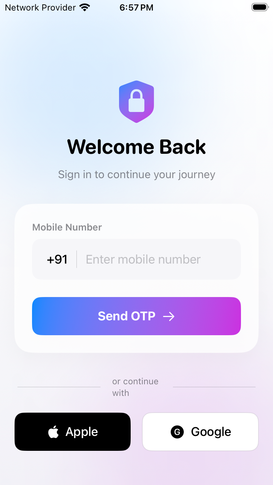
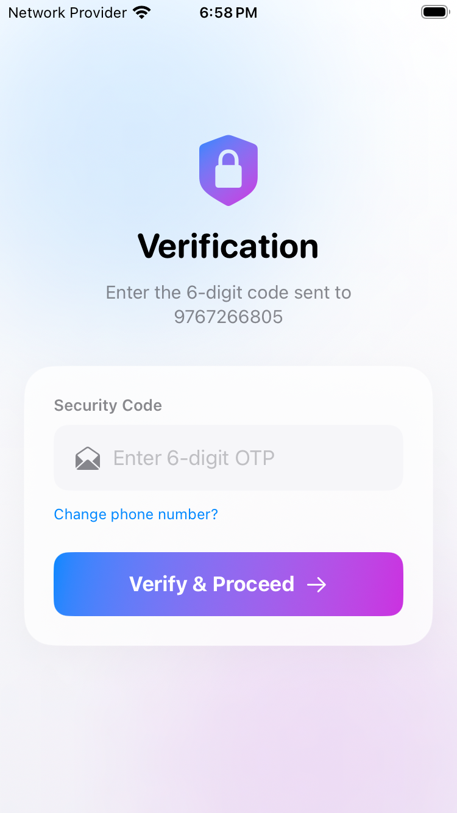
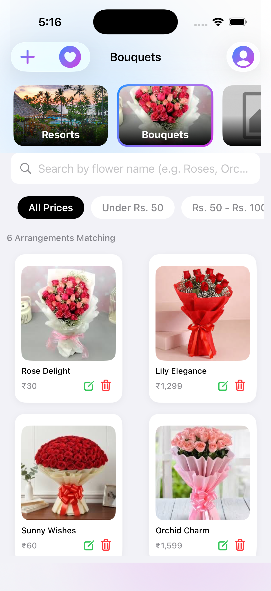
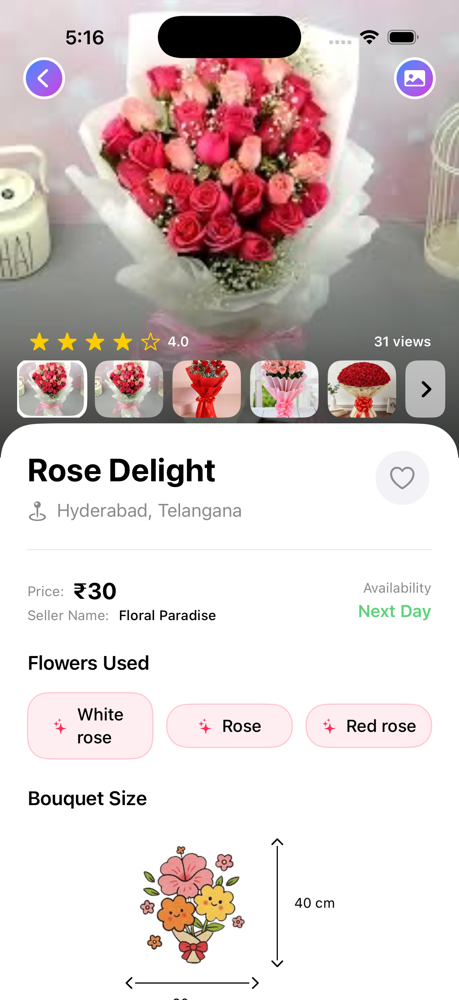
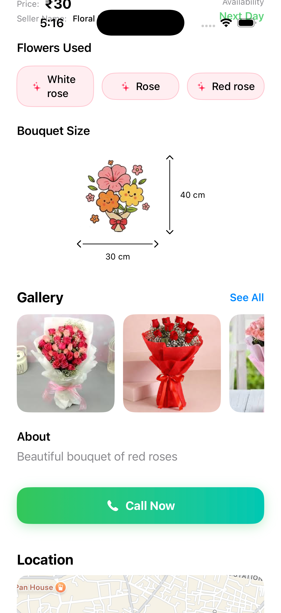
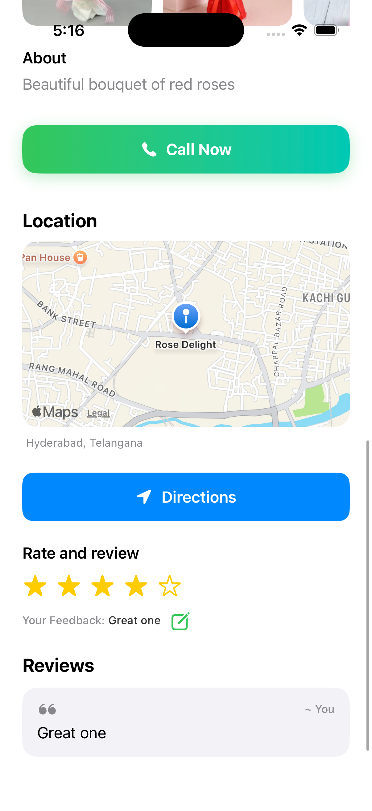
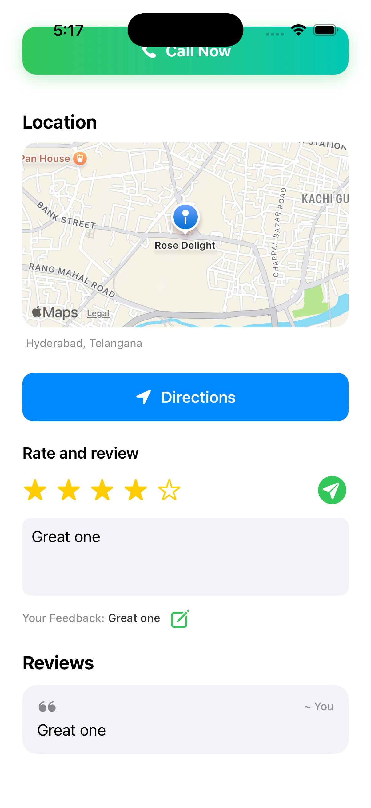
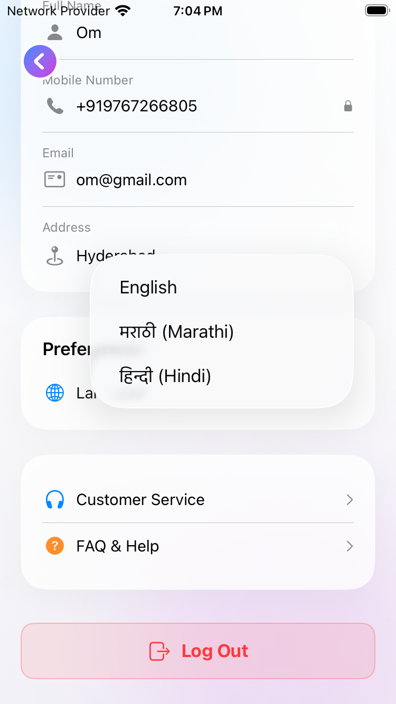
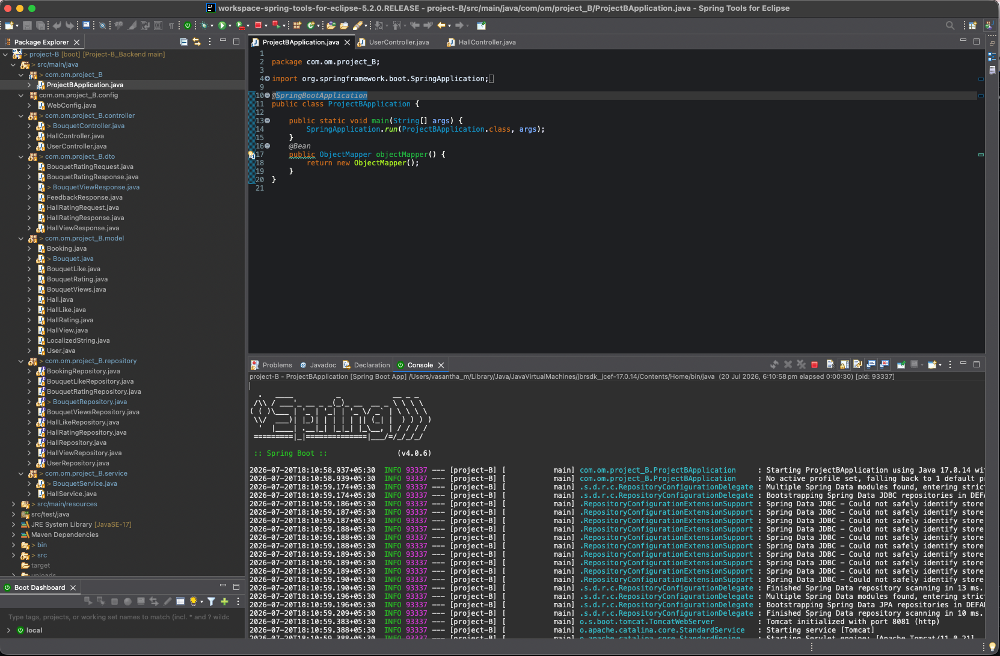
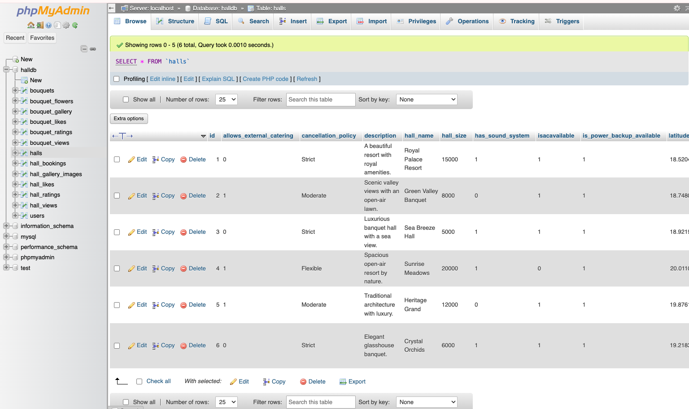

# 💐 Bouquet Booking Application

A full-stack iOS application that allows users to browse, explore, and book beautiful bouquets while checking their real-time availability. The application provides a seamless booking experience with role-based access for **Admin** and **User**, multilingual support, secure authentication, and an intuitive user interface.

---

# 📱 Features

## 🔐 Phone Number Authentication
The application provides secure user authentication using **Firebase Phone Authentication**. Users can log in using their mobile number and OTP verification. The registered mobile number is used only for authentication and cannot be modified.

---

## 👥 Role-Based Access Control
The application supports two different user roles:

- **User**
  - Browse bouquets
  - View bouquet details
  - Like/Favorite bouquets
  - Submit ratings and feedback
  - Check bouquet availability

- **Admin**
  - Add new bouquets
  - Update existing bouquet information
  - Manage bouquet availability
  - Maintain bouquet catalog

---

## 🏠 Home Screen
The home screen displays a collection of bouquet cards containing essential information. Selecting a bouquet navigates the user to the detailed information screen.

---

## 💐 Bouquet Details
Each bouquet contains detailed information including:

- Bouquet Images
- Bouquet Name
- Price
- Flowers Used
- Bouquet Size
- Availability (Same Day / Next Day)
- Shop Location
- Map & Navigation Support
- View Count
- Ratings & Reviews

---

## 🔍 Search & Filters
Users can quickly find bouquets using the built-in search and filtering options.

Available filters include:

- Search by Bouquet Name
- Price Under ₹50
- Price Between ₹50 – ₹100
- Price Above ₹100

---

## ❤️ Favorites
Users can save their favorite bouquets by tapping the heart icon. All liked bouquets are available in a dedicated Favorites section for quick access.

---

## ⭐ Ratings & Feedback
Users can rate and review bouquets after viewing them. Each user can submit one review per bouquet and update it whenever required. Ratings are displayed to all users to help them make better purchasing decisions.

---

## 👀 View Count
The application tracks the number of views for each bouquet. This helps users identify popular bouquets while providing useful insights to administrators.

---

## 🌍 Multi-Language Support
The application supports multiple languages that can be changed from the Profile section.

Supported Languages:

- English
- Hindi
- Marathi

---

## 👤 Profile Management
The Profile section allows users to:

- Update Name
- Update Email
- Update Address
- Upload Profile Picture
- Change Application Language

The registered mobile number remains fixed since it is used for authentication.

---

## 📍 Map Integration
Users can view the exact location of the bouquet shop on the map. A navigation button opens the device's default Maps application to provide directions from the user's current location.

---

# 🛠️ Tech Stack

## Frontend

- Swift
- SwiftUI
- Firebase Phone Authentication
- VIPER Architecture
- Async/Await
- REST API Integration
- MapKit

---

## Backend

- Spring Boot
- REST APIs

---

## Database

- MySQL

---

# 🔄 Backend Integration

The backend is developed using **Spring Boot**, exposing REST APIs that are consumed by the iOS application. All bouquet information, user data, availability, favorites, ratings, and feedback are stored in a **MySQL** database.

The application is currently configured to run with a **localhost** backend during development.

---

# 🚀 Future Enhancements

- Online Bouquet Ordering
- Payment Gateway Integration
- Push Notifications
- Order Tracking
- Delivery Slot Selection
- Coupon & Discount Support
- Wishlist Sharing
- Admin Dashboard & Analytics

---

# 📱 Preview

 

# 📱 Frontend Screenshots (iOS Application)

  
   
   
   
  

# Backend (Spring Boot)

# Database

---

# 👨‍💻 Author

**Om Makode**

Native iOS Developer

---

